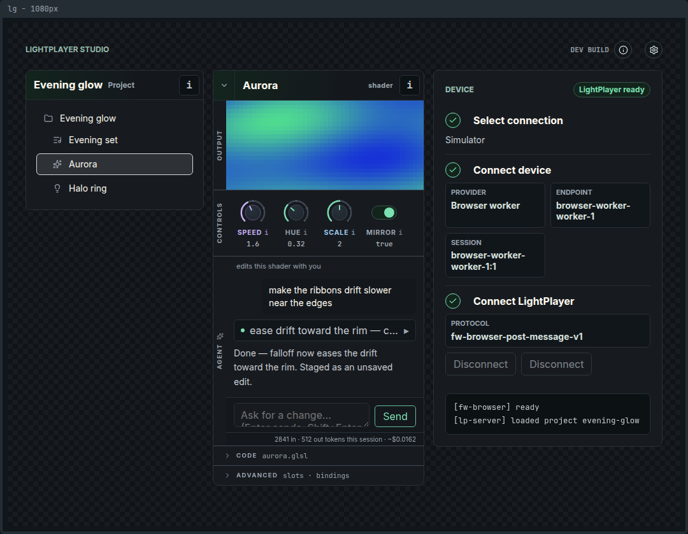
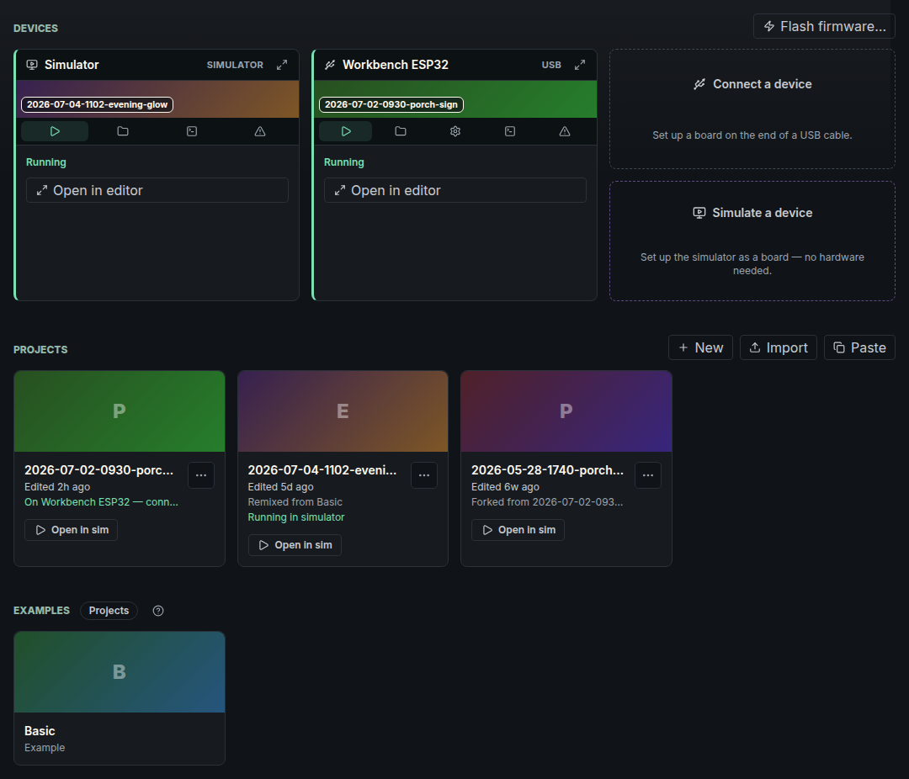
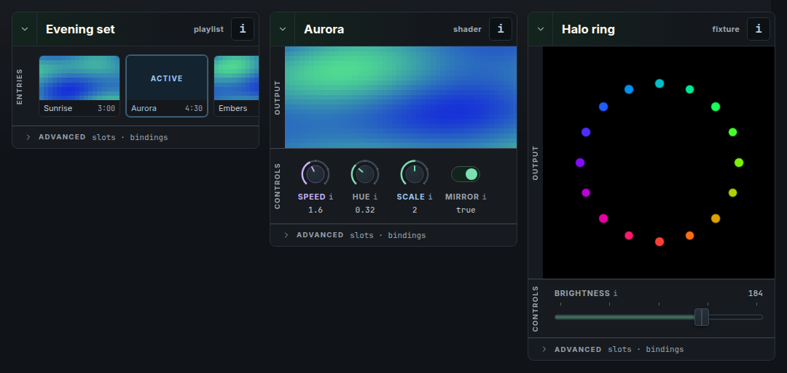

<p align="center">
  
</p>

<p align="center"><em>Friendly shaders, everywhere.</em></p>

LightPlayer is an open platform for LED art: author effects as GLSL shaders in a browser studio,
preview them in a built-in simulator, and run them on real hardware — where they are JIT-compiled
to native code on the device itself.

**Try it now at [lightplayer.app](https://lightplayer.app)** — the Studio runs entirely in your
browser, and the built-in simulator means you don't need any hardware to start playing.





**What makes it different:**

- **GLSL, compiled on the device.** A full compiler stack (GLSL → LPIR → native machine code) runs
  on the microcontroller itself, JIT-compiling shaders to RISC-V or Xtensa machine code — in
  Q16.16 fixed point on chips without a floating-point unit, native float where there is one.
- **Studio in your browser.** Live previews, node-based project editing, a 2D fixture-mapping
  editor, and AI-assisted shader authoring (bring your own API key). The built-in simulator runs
  the real firmware as a WASM worker — no hardware needed to try everything.
- **Plug it in.** USB-first: connect a device and go. No WiFi provisioning dance.
- **Self-contained, open projects.** A project is a folder of JSON and GLSL files. Open format,
  AGPL-licensed platform.



# Status: alpha

LightPlayer is in **alpha**. A determined tester can get real value today: author GLSL effects in
the browser studio, run them in the simulator without hardware, and drive WS2812-class strips from
an ESP32-family board over USB. Expect rough edges and breaking changes — there are no project-format or
protocol compatibility promises yet. The Studio requires a Chromium-based browser (it uses
WebSerial and OPFS). Issue reports are welcome.

# Quick Start

The fastest path is the hosted Studio at **[lightplayer.app](https://lightplayer.app)**
(deployed from `main`; no install, no hardware — open it in a Chromium-based browser).

To run everything from source:

```bash
# Clone the repo
git clone https://github.com/photomancerart/lightplayer.git
cd lightplayer

# Initialize your development environment
scripts/dev-init.sh

# Run the browser Studio (with built-in simulator — no hardware needed)
just studio-dev
```

Then open the Studio in a Chromium-based browser, open an example project, and connect it to the
browser simulator.

For a headless engine demo without the Studio:

```bash
just demo
just demo <example-name>   # run other examples (see examples/)
```

# Run on hardware

LightPlayer runs on ESP32-family boards — ESP32-C6 (RISC-V), ESP32-S3, and classic ESP32 (both
Xtensa) — with the supported-board list at
**[lightplayer.app/#/boards](https://lightplayer.app/#/boards)**. Shaders are JIT-compiled to the
chip's own instruction set, on the chip. It goes surprisingly fast on modest silicon: a
decade-old classic ESP32 drives 1,500 LEDs across five outputs at 30 fps, using both cores.

The quickest demo path uses an ESP32-C6. To flash firmware, push the `examples/basic` project over
USB serial, and run it on real hardware:

```bash
just demo-esp32c6-host
```

You need an ESP32-C6 board connected by USB, the RISC-V target installed (the recipe runs
`install-rv32-target`), and [`espflash`](https://github.com/esp-rs/espflash) on your `PATH` for
flashing.

**Wiring:** connect a WS2812-class addressable strip's data line to **GPIO 18**. Where outputs go
is configured, not hardcoded: each output channel names a board endpoint — `ws281x:local:D10` in
[`examples/basic/output.json`](examples/basic/output.json) — which the board's manifest maps to a
physical pin (the default ESP32-C6 profile maps `D10` to GPIO 18). Outputs can be rewired from the
Studio, boards can drive multiple output channels concurrently (up to 1,024 LEDs per channel), and
a `/hardware.json` pushed to the device overrides the built-in board profile.

For an empty flash and firmware only (no project push), use `just demo-esp32c6-standalone`.

# Development

1. **Initialize the development environment:**

   ```bash
   scripts/dev-init.sh
   ```

   This will:
   - Check for required tools (Rust, Cargo, rustup, just, oxipng)
   - Verify Rust version meets minimum requirements (1.90.0+)
   - Install the RISC-V target (`riscv32imac-unknown-none-elf`) if needed
   - Set up git hooks (pre-commit hook runs `just check`)

2. **Required tools:**
   - Rust toolchain (1.90.0 or later) - [Install Rust](https://rustup.rs/)
   - `just` - Task runner: `cargo install just` or via package manager
   - `oxipng` - Lossless PNG optimizer for Studio story image baselines:
     `cargo install oxipng` or `brew install oxipng`

3. **Common development commands:**
   - `just fci` - Fix, check, build, and test the whole project. Do this before you submit a PR.
   - `just fci-app` - Fix, check, build, and test the application.
   - `just fci-glsl` - Fix, check, build, and test the GLSL compiler.

See `just --list` for all available commands, and [`docs/development.md`](docs/development.md) for
deeper workflows: board manifests, schema generation, GPIO calibration, and on-hardware
firmware tests.

# Repository Structure

- **`lp-app/`** Browser Studio (Dioxus + WASM): studio UI, server/client, device link, OPFS
  filesystem, browser firmware host
- **`lp-core/`** Platform core (`lpc-*` crates): rendering engine, data model, wire protocol,
  registry, board manifests
- **`lp-shader/`** GLSL compiler: frontend (via naga), LightPlayer IR, backends (native RISC-V
  and Xtensa JIT, Cranelift, WASM), Q16.16 fixed-point math, and the filetest suite — see
  [`lp-shader/README.md`](lp-shader/README.md)
- **`lp-fw/`** Firmware: ESP32 targets (`fw-esp32c6`, `fw-esp32s3`, and `fw-esp32v3` for the
  classic ESP32) over a shared chip-generic layer (`fw-esp32-common`), the multi-channel WS281x
  driver (`lp-ws281x`), host and browser runtimes (`fw-host`, `fw-browser`), emulator firmware
  (`fw-emu`), and integration tests (`fw-tests`) — see [`lp-fw/README.md`](lp-fw/README.md)
- **`lp-gfx/`** GPU rendering layer (wgpu) used for Studio previews
- **`lp-emu/`** Architecture-neutral emulator substrate (`lp-emu-core`) and host↔guest ABI
  (`lp-emu-abi`) shared by the architecture emulators
- **`lp-riscv/`** RISC-V 32-bit emulator, instruction encoding/decoding, and ELF tooling
- **`lp-xt/`** Xtensa (ESP32-S3 / classic ESP32) instruction model, emulator, and ELF tooling —
  the Xtensa counterpart to `lp-riscv/`
- **`lp-cli/`** Developer CLI (projects, dev server, board manifests, GPIO calibration); runs
  from a source checkout
- **`lp-base/`** Foundation crates: collections, filesystem, performance, recovery
- **`examples/`** Example LightPlayer projects
- **`schemas/`** Generated JSON Schemas for project/node/board files
- **`docs/`** Documentation, ADRs, and design notes
- **`scripts/`** Build scripts and development utilities
- **`third_party/`** Vendored forks (naga, and friends)

# Acknowledgments

LightPlayer follows in the footsteps of the LED-art projects that shaped this space:

- **[Pixelblaze](https://electromage.com/)** by Ben Hencke — the pioneer of live-coded LED
  shaders on a microcontroller, and proof that pattern authoring could be joyful. Ben has
  also been generous with ideas in conversation, including embedded trig techniques that
  found their way into LightPlayer. If you want polished ready-to-go hardware with a
  brilliant integrated editor, buy a Pixelblaze.
- **[WLED](https://kno.wled.ge/)** — the project that brought addressable LEDs to
  everyone; its community and effect vocabulary informed many of LightPlayer's goals.

LightPlayer would not be possible without the amazing work of these projects:

- **[Cranelift](https://cranelift.dev/)** - Fast, secure compiler
  backend ([forked](https://github.com/Yona-Appletree/lp-cranelift) to support 32-bit RISC-V and
  `no_std`)
- **[Naga](https://github.com/gfx-rs/wgpu/tree/main/naga)** - Shader IR and **`glsl-in`** GLSL
  frontend (used by `lps-frontend`)
- **[pp-rs](https://github.com/photomancerart/pp-rs)** - GLSL preprocessor fork, patched in
  **`[patch.crates-io]`** in the workspace `Cargo.toml` so naga `glsl-in` works on **`no_std`**
  targets
- **[glsl-parser](https://git.sr.ht/~hadronized/glsl)** - GLSL parser (
  [forked](https://github.com/photomancerart/glsl-parser) for spans)
- **[Lygia](https://github.com/patriciogonzalezvivo/lygia)** - Shader library (source for lpfn
  built-in functions)
- **[DirectXShaderCompiler](https://github.com/microsoft/DirectXShaderCompiler)** - HLSL compiler (
  compiler architecture inspiration)
- **[esp-hal](https://github.com/esp-rs/esp-hal)** - Pure Rust ESP32 bare metal HAL (used for ESP32
  firmware)
- **[GLSL Specification](https://github.com/KhronosGroup/GLSL)** - GLSL language reference
- **[RISC-V Instruction Set Manual](https://github.com/msyksphinz-self/riscv-isadoc)** - RISC-V
  architecture documentation
- **[RISC-V ELF psABI Specification](https://github.com/riscv-non-isa/riscv-elf-psabi-doc)** -
  RISC-V ABI documentation

... and many more not listed. Thank you to everyone in the open source community for your work.

Special thanks to @SeanConnell for his support and guidance throughout the development of
the project.

# License

LightPlayer-owned code is licensed under the GNU Affero General Public License version 3 or later
(`AGPL-3.0-or-later`). See [LICENSE](LICENSE) for the full license text.

Third-party code, vendored forks, and dependencies remain under their own licenses.

Contributions are accepted under the terms in [CONTRIBUTING.md](CONTRIBUTING.md).
